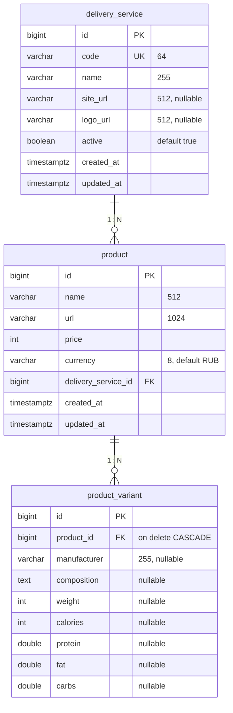

# Схема БД Food Helper

Связи между таблицами (соответствуют миграциям в `service/src/main/resources/db/changelog/`).

## Диаграмма Mermaid

**Обозначения на диаграмме:** `||--o{` — связь **один ко многим** (слева один, справа много). Читать стрелку: у одной сущности слева — много сущностей справа.

---

## Связи (One / Many)

### 1. delivery_service ↔ product

| Сторона | Тип связи | Описание |
|---------|-----------|----------|
| **delivery_service → product** | **One to Many** | Одна служба доставки имеет много продуктов. |
| **product → delivery_service** | **Many to One** | Много продуктов относятся к одной службе доставки. |

- Внешний ключ: `product.delivery_service_id` → `delivery_service.id`
- При удалении службы: `NO_ACTION` (у продукта не удаляется ссылка автоматически)

### 2. product ↔ product_variant

| Сторона | Тип связи | Описание |
|---------|-----------|----------|
| **product → product_variant** | **One to Many** | Один продукт имеет много вариантов (разный вес, состав, КБЖУ). |
| **product_variant → product** | **Many to One** | Много вариантов относятся к одному продукту. |

- Внешний ключ: `product_variant.product_id` → `product.id`
- При удалении продукта: `CASCADE` (варианты удаляются вместе с продуктом)

---

## Таблицы

- **delivery_service** — службы доставки (Яндекс Еда, Delivery Club и т.д.).
- **product** — товар в одной службе доставки (название, ссылка, цена).
- **product_variant** — вариант товара (производитель, состав, вес, КБЖУ). У одного продукта может быть несколько вариантов.

Индексы: по `delivery_service_id`, по `name` (и поиск через pg_trgm), по полям КБЖУ в `product_variant` — см. миграции 001 и 003.
