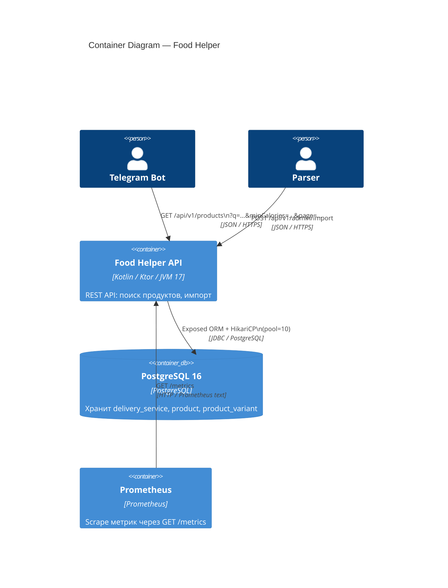
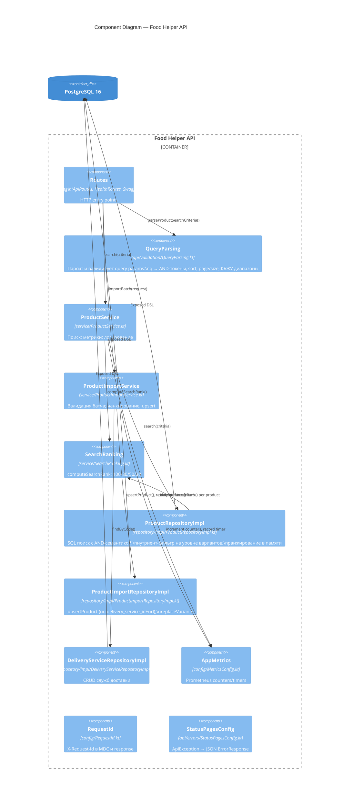
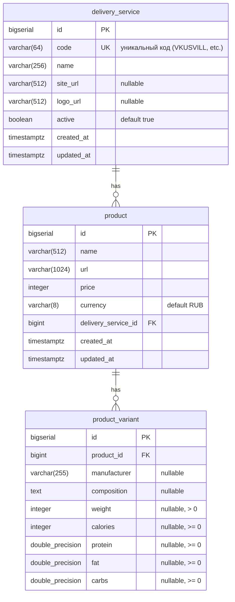

# Architecture — Food Helper Backend

## C4 Level 1: System Context

```mermaid
C4Context
    title System Context — Food Helper

    Person(user, "Telegram User", "Ищет продукты по КБЖУ через Telegram-бот")

    System(bot, "Telegram Bot", "Принимает запросы пользователя,\nлистает результаты постранично")
    System(backend, "Food Helper API", "Ktor REST API.\nПоиск продуктов, импорт от парсера")
    System(parser, "Parser", "Обходит сайты доставок,\nобновляет данные раз в сутки")

    SystemExt(vkusvill, "ВкусВилл", "Сайт доставки")
    SystemExt(lavka, "Яндекс Лавка", "Сайт доставки")
    SystemExt(samokat, "Самокат", "Сайт доставки")

    Rel(user, bot, "Отправляет запрос", "Telegram")
    Rel(bot, backend, "GET /api/v1/products", "HTTPS / JSON")
    Rel(parser, backend, "POST /api/v1/admin/import", "HTTPS / JSON")
    Rel(parser, vkusvill, "Парсит", "HTTPS")
    Rel(parser, lavka, "Парсит", "HTTPS")
    Rel(parser, samokat, "Парсит", "HTTPS")
```

## C4 Level 2: Container



## C4 Level 3: Component



---

## ERD



### Constraints & Indexes

| Object | Type | Definition | Purpose |
|--------|------|-----------|---------|
| `uq_product_delivery_url` | UNIQUE | `(delivery_service_id, url)` | Идемпотентный upsert от парсера |
| `idx_product_delivery_service` | INDEX | `product(delivery_service_id)` | Фильтр по службе доставки |
| `idx_product_name` | INDEX | `product(name)` | Сортировка по имени |
| `idx_product_name_lower_gin` | GIN | `lower(product.name) gin_trgm_ops` | Быстрый substring search (pg_trgm) |
| `idx_variant_product_id` | INDEX | `product_variant(product_id)` | JOIN с product |
| `idx_variant_prod_cal` | INDEX | `product_variant(product_id, calories)` | КБЖУ-фильтр |
| `idx_variant_cal_prot` | INDEX | `product_variant(calories, protein)` | Составной нутриент-фильтр |
| `idx_variant_cal_fat` | INDEX | `product_variant(calories, fat)` | Составной нутриент-фильтр |

---

## Q Search Semantics

```
?q=молоко овсяное
         │
         ▼
tokens = ["молоко", "овсяное"]    (trim → lowercase → split by \s+ → filter empty)
         │
         ▼ SQL WHERE (AND semantics)
for each token:
  product.name ILIKE '%token%'
  OR product.id IN (SELECT product_id FROM product_variant
                     WHERE LOWER(COALESCE(composition,'')) LIKE '%token%')
         │
         ▼ In-memory ranking (up to 2000 candidates)
computeSearchRank(name, matchedVariant.compositions, tokens, fullPhrase)
  → 100: exact phrase in name
  → 80:  all tokens in name
  → 50:  some tokens in name, rest in one composition variant
  → 30:  all tokens only in composition
         │
         ▼ Stable sort: rank DESC, name ASC (case-insensitive), id ASC
         │
         ▼ Page slice: drop(page*size).take(size)
```

## Import Flow

```
POST /api/v1/admin/import
         │
         ▼ Request-level validation (→ 400 if any fails)
  deliveryServiceCode not blank
  items not empty
  items.size ≤ maxItemsPerRequest (default 500)
         │
         ▼ Resolve deliveryService by code (→ error result if not found)
         │
         ▼ Chunk items by chunkSize (default 100)
         │
  for each item:
    ▼ Item-level validation (→ failed item, rest continue)
      name/url not blank, url absolute http/https, url ≤ 1024, name ≤ 512
      price ≥ 0, currency not blank
      weight > 0 if provided
      nutrient values ≥ 0 if provided
    ▼ upsertProduct(deliveryServiceId, name, url, price, currency)
        unique on (delivery_service_id, url) — UPDATE or INSERT
    ▼ replaceVariants(productId, variants)
        DELETE all variants for product, bulk INSERT new ones
         │
         ▼ Return ImportResultDto { importedCount, failedCount, errors[] }
```
