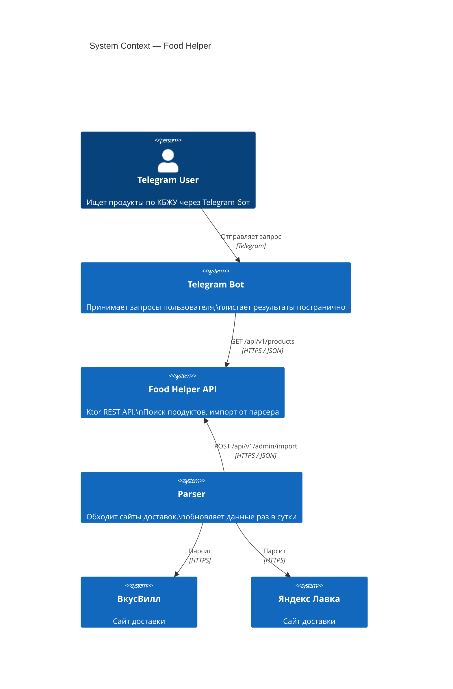
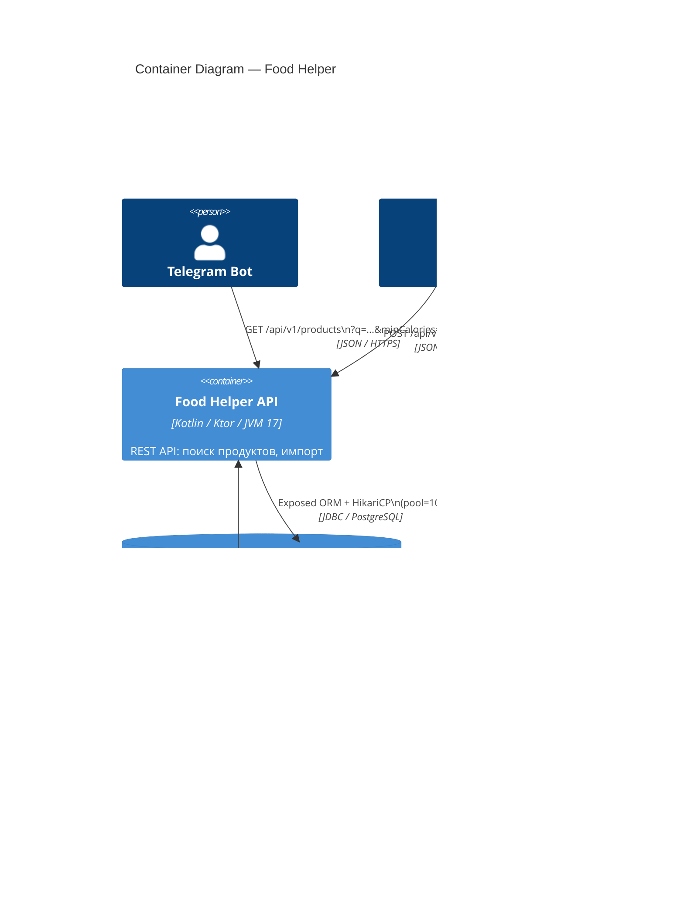
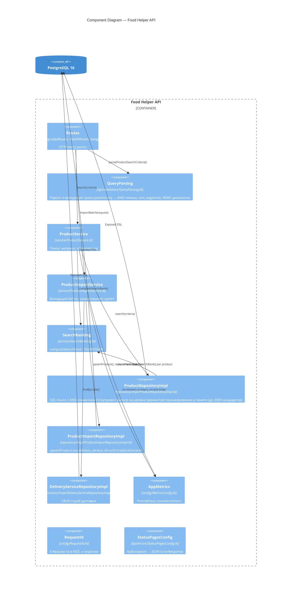
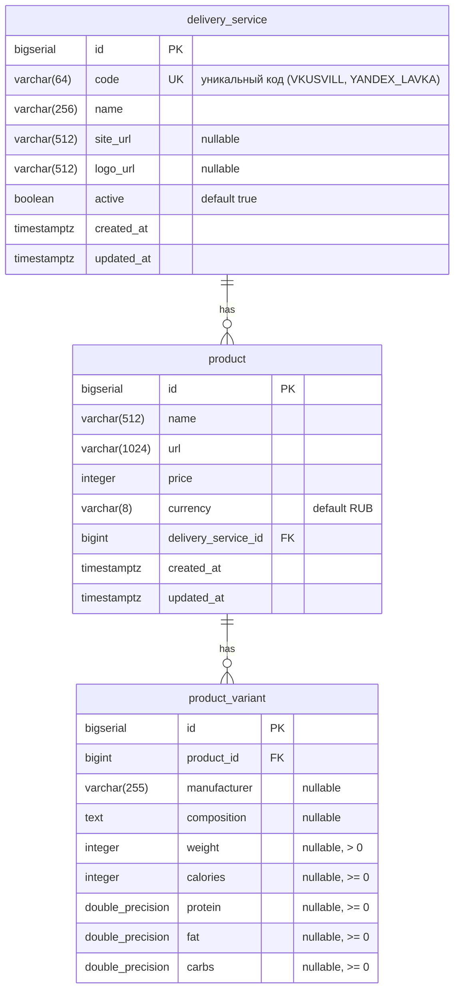

# Architecture — Food Helper Backend

## C4 Level 1: System Context



## C4 Level 2: Container



## C4 Level 3: Component



---

## ERD



### Constraints & Indexes

| Object | Type | Definition | Purpose |
|--------|------|-----------|---------|
| `uq_product_delivery_url` | UNIQUE | `(delivery_service_id, url)` | Идемпотентный upsert от парсера |
| `idx_product_delivery_service` | INDEX | `product(delivery_service_id)` | Фильтр по службе доставки |
| `idx_product_name` | INDEX | `product(name)` | Сортировка по имени |
| `idx_product_name_lower_gin` | GIN | `lower(product.name) gin_trgm_ops` | Быстрый substring search по названию (pg_trgm) |
| `idx_variant_composition_lower_gin` | GIN | `lower(composition) gin_trgm_ops` | Быстрый substring search по составу (pg_trgm, CONCURRENT) |
| `idx_variant_product_id` | INDEX | `product_variant(product_id)` | JOIN с product |
| `idx_variant_prod_cal` | INDEX | `product_variant(product_id, calories)` | КБЖУ-фильтр |
| `idx_variant_cal_prot` | INDEX | `product_variant(calories, protein)` | Составной нутриент-фильтр |
| `idx_variant_cal_fat` | INDEX | `product_variant(calories, fat)` | Составной нутриент-фильтр |

---

## Q Search Semantics

```
?q=молоко овсяное
         │
         ▼
tokens = ["молоко", "овсяное"]    (trim → lowercase → split by \s+ → filter empty)
         │
         ▼ SQL WHERE (AND semantics)
for each token:
  product.name ILIKE '%token%'
  OR product.id IN (SELECT product_id FROM product_variant
                     WHERE LOWER(COALESCE(composition,'')) LIKE '%token%')
         │
         ▼ In-memory ranking (up to 2000 candidates)
computeSearchRank(name, matchedVariant.compositions, tokens, fullPhrase)
  → 100: exact phrase in name
  → 80:  all tokens in name
  → 50:  some tokens in name, rest in one composition variant
  → 30:  all tokens only in composition
         │
         ▼ Stable sort: rank DESC, name ASC (case-insensitive), id ASC
         │
         ▼ Page slice: drop(page*size).take(size)
```

## Import Flow

```
POST /api/v1/admin/import
         │
         ▼ Request-level validation (→ 400 if any fails)
  deliveryServiceCode not blank
  items not empty
  items.size ≤ maxItemsPerRequest (default 500)
         │
         ▼ Resolve deliveryService by code (→ error result если не найден)
         │
         ▼ Chunk items by chunkSize (default 100)
         │
  for each item:
    ▼ Item-level validation (→ failed item, rest continue)
      name/url not blank, url absolute http/https, url ≤ 1024, name ≤ 512
      price ≥ 0, currency not blank
      variants not empty
      weight > 0 if provided
      nutrient values ≥ 0 if provided
    ▼ upsertProduct(deliveryServiceId, name, url, price, currency)
        unique on (delivery_service_id, url) — UPDATE or INSERT
    ▼ replaceVariants(productId, variants)
        DELETE all variants for product, bulk INSERT new ones
         │
         ▼ Return ImportResultDto {
             totalReceived, duplicatesResolved,
             created, updated, failed,
             durationMs, errors[]
           }
```

---

## Deployment Architecture (prod)

```
Internet
   │  HTTPS :443 / HTTP :80
   ▼
nginx (Ingress Controller)          ← food_helper_nginx, port 80
   ├── GET /                        → serve /usr/share/nginx/html (Frontend SPA, volume)
   ├── GET /api/*                   → proxy_pass http://food_helper_api:8080
   ├── GET /health, /ready, /swagger
   └── GET /metrics                 → only 127.0.0.1 (deny external)
         │
         ▼ HTTP (internal Docker network: food_helper_net)
Food Helper API                     ← food_helper_api, binds 0.0.0.0:8080 (внутри сети)
   └── JDBC
         ▼
PostgreSQL 16                       ← food_helper_postgres, порт 5432 (internal only)

Prometheus                          ← food_helper_prometheus, 127.0.0.1:9090
   └── scrape food_helper_api:8080/metrics every 15s
         ▼
Grafana                             ← food_helper_grafana, 127.0.0.1:3000 (SSH tunnel)
```

### nginx Key Settings

| Параметр | Значение | Причина |
|----------|----------|---------|
| `client_max_body_size` | `5m` | 500 items × ~2 KB ≈ 1 MB + запас |
| `proxy_read_timeout` | `60s` | Импорт 500 items + запись в БД |
| `proxy_set_header X-Forwarded-Proto` | `$scheme` | Логирование HTTPS |
| `proxy_set_header X-Real-IP` | `$remote_addr` | IP клиента в логах |
| `/metrics` allow | `127.0.0.1` | Метрики не доступны снаружи |

### Container Names & Ports

| Контейнер | Внутренний порт | Локальный | Прод |
|-----------|----------------|-----------|------|
| `food_helper_nginx` | 80 | 8090 | 80 |
| `food_helper_api` | 8080 | — (нет проброса) | — |
| `food_helper_postgres` | 5432 | 5433 | 5432 (127.0.0.1) |
| `food_helper_prometheus` | 9090 | 9091 | 9090 (127.0.0.1) |
| `food_helper_grafana` | 3000 | 3001 | 3000 (SSH tunnel) |

---

## Observability

### Structured Logs

| Event | Поля |
|-------|------|
| `search.start` | q, page, size, filters, requestId |
| `search.finish` | q, totalElements, durationMs, requestId |
| `search.empty_result` | q, filters, requestId |
| `import.start` | deliveryServiceCode, itemsCount, requestId |
| `import.finish` | created, updated, failed, durationMs, requestId |
| `import.item_error` | itemIndex, url, errorCode, message, requestId |

### Prometheus Metrics

| Метрика | Тип | Описание |
|---------|-----|---------|
| `product_search_requests_total` | Counter | Всего поисковых запросов |
| `product_search_empty_results_total` | Counter | Запросов с пустой выдачей |
| `product_import_requests_total` | Counter | Всего запросов импорта |
| `product_import_items_total` | Counter | Всего items в импорте |
| `product_import_failed_items_total` | Counter | Провалившихся items |
| `product_import_duration` | Timer | Длительность импорта |
| HTTP-метрики | auto | Ktor MicrometerMetrics (latency, status codes) |

### Request ID

Каждый запрос получает UUID в `X-Request-Id`:
- Берётся из входящего заголовка `X-Request-Id` (если задан клиентом)
- Иначе генерируется
- Пишется в MDC Logback → присутствует во всех log-строках
- Возвращается в ответе и в теле `ErrorResponse.requestId`
